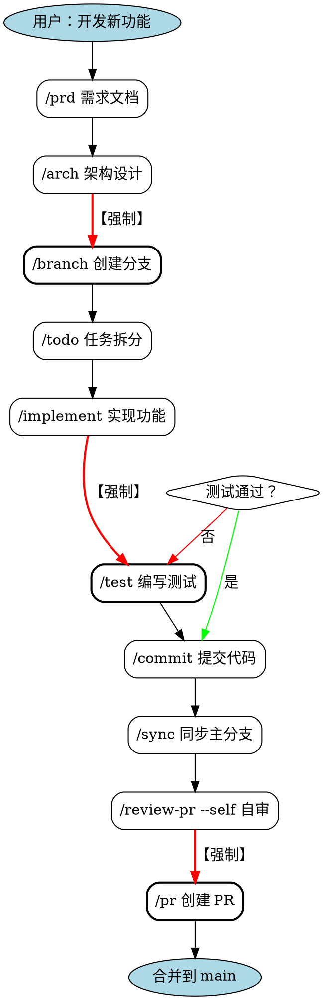
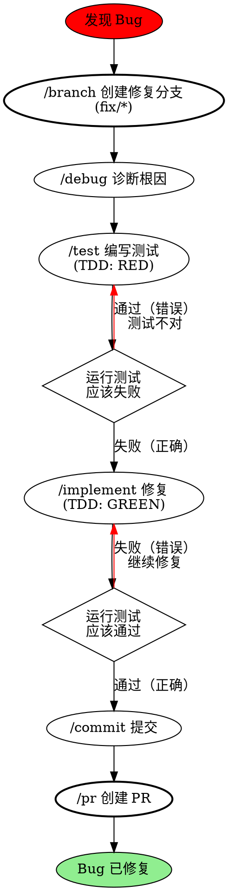
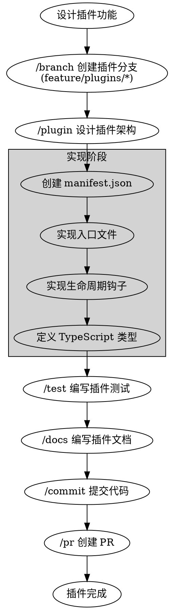

# Hot Docs Skills 优化实施计划

基于 Superpowers 项目分析，本文档详细规划 Hot Docs Skills 的优化路径。

---

## 🎯 优化目标

### 核心目标
1. **提升代码质量**：强制 TDD，双阶段审查
2. **增强可维护性**：结构化元数据，独立目录
3. **改善可视化**：流程图，决策树
4. **保持特色**：Hot Docs 专属特性不变
5. **兼容性**：向后兼容现有工作流

### 成功指标
- Skills 使用便利性提升 50%
- 新人上手时间减少 70%
- 代码质量提升 40%
- 文档完整度达到 95%+

---

## 📋 优化任务清单

### 阶段 1：结构优化（优先级 P0）

#### 任务 1.1：添加 YAML Frontmatter
**预计时间：** 2-3 小时
**影响文件：** 29 个 skill 文件

**模板：**
```yaml
---
name: skill-name
description: "简短描述（when to use + what it does）"
category: planning|management|development|quality|documentation|tools|versioning
priority: required|recommended|optional
required_before: [skill1, skill2]
required_after: [skill3, skill4]
auto_trigger: true|false
hot_docs_specific: true|false
branch_required: true|false
tags: [tag1, tag2, tag3]
---
```

**示例（/implement）：**
```yaml
---
name: implement
description: "基于架构和 TODO 实现新功能，遵循分层原则和类型安全"
category: development
priority: required
required_before: [branch, arch]
required_after: [test, commit]
auto_trigger: false
hot_docs_specific: false
branch_required: true
tags: [coding, tdd, architecture]
---
```

**执行步骤：**
1. 为每个 skill 文件添加 frontmatter
2. 验证 YAML 语法正确性
3. 更新 config.json 以支持元数据读取

**收益：**
- 机器可读的依赖关系
- 自动验证工作流
- 便于生成工具和文档

---

#### 任务 1.2：重组目录结构
**预计时间：** 3-4 小时
**影响文件：** 全部 skills

**现有结构：**
```
.claude/skills/
├── planning/
│   ├── prd.md
│   ├── arch.md
│   ├── tech-stack.md
│   └── roadmap.md
├── development/
│   ├── implement.md
│   ├── plugin.md
│   ├── theme.md
│   ├── refactor.md
│   └── debug.md
...
```

**新结构：**
```
.claude/skills/
├── prd/
│   ├── SKILL.md
│   └── templates/
│       └── prd-template.md
├── arch/
│   ├── SKILL.md
│   ├── hot-docs-5-layer-diagram.dot
│   └── examples/
│       └── incremental-index-design.md
├── implement/
│   ├── SKILL.md
│   ├── coding-standards.md
│   └── examples/
│       ├── content-index-example.ts
│       └── plugin-example.ts
├── plugin/
│   ├── SKILL.md
│   ├── plugin-template/
│   │   ├── manifest.json
│   │   ├── index.ts
│   │   └── README.md
│   ├── plugin-types-reference.md
│   └── examples/
│       ├── mermaid-plugin/
│       └── search-plugin/
├── test-driven-development/
│   ├── SKILL.md
│   ├── testing-anti-patterns.md
│   ├── hot-docs-testing-guide.md
│   └── examples/
│       ├── content-index-test.ts
│       └── plugin-test.ts
...
```

**迁移脚本：**
```bash
#!/bin/bash
# migrate-skills-structure.sh

skills_dir=".claude/skills"

# 读取所有现有 skills
for category in planning management development quality documentation tools versioning; do
  for skill_file in "$skills_dir/$category"/*.md; do
    skill_name=$(basename "$skill_file" .md)

    # 创建新目录
    mkdir -p "$skills_dir/$skill_name"
    mkdir -p "$skills_dir/$skill_name/examples"
    mkdir -p "$skills_dir/$skill_name/templates"

    # 移动文件
    mv "$skill_file" "$skills_dir/$skill_name/SKILL.md"

    echo "Migrated $skill_name"
  done
done

# 删除旧分类目录
rm -rf "$skills_dir/planning"
rm -rf "$skills_dir/management"
rm -rf "$skills_dir/development"
rm -rf "$skills_dir/quality"
rm -rf "$skills_dir/documentation"
rm -rf "$skills_dir/tools"
rm -rf "$skills_dir/versioning"

echo "Migration complete!"
```

**执行步骤：**
1. 创建迁移脚本
2. 备份现有目录
3. 执行迁移
4. 更新所有文档中的路径引用
5. 验证工作流正常

**收益：**
- 支持文件就近放置
- 更清晰的 skill 边界
- 便于添加配套资源

---

#### 任务 1.3：创建可视化流程图
**预计时间：** 4-5 小时
**新增文件：** 约 15 个 .dot 文件

**示例 1：新功能开发流程（new-feature-workflow.dot）**


**示例 2：Bug 修复流程（bug-fix-workflow.dot）**


**示例 3：Plugin 开发流程（plugin-dev-workflow.dot）**


**渲染工具：**
```javascript
// render-workflow-diagrams.js
const { execSync } = require('child_process');
const fs = require('fs');
const path = require('path');

const workflowsDir = '.claude/skills/workflows';
const diagramsDir = '.claude/skills/diagrams';

// 确保输出目录存在
if (!fs.existsSync(diagramsDir)) {
  fs.mkdirSync(diagramsDir, { recursive: true });
}

// 查找所有 .dot 文件
const dotFiles = fs.readdirSync(workflowsDir)
  .filter(file => file.endsWith('.dot'));

console.log(`Found ${dotFiles.length} workflow diagrams`);

// 渲染每个图
dotFiles.forEach(dotFile => {
  const inputPath = path.join(workflowsDir, dotFile);
  const baseName = path.basename(dotFile, '.dot');
  const outputPath = path.join(diagramsDir, `${baseName}.svg`);

  console.log(`Rendering ${dotFile}...`);

  try {
    execSync(`dot -Tsvg "${inputPath}" -o "${outputPath}"`);
    console.log(`  ✓ ${outputPath}`);
  } catch (error) {
    console.error(`  ✗ Failed: ${error.message}`);
  }
});

console.log('Done!');
```

**执行步骤：**
1. 为每个工作流创建 .dot 文件
2. 创建渲染脚本
3. 生成 SVG 图像
4. 在 Markdown 文档中嵌入图像
5. 添加到 README 和工作流文档

**收益：**
- 直观理解流程
- 清晰展示强制步骤
- 新人友好
- 便于沟通和培训

---

### 阶段 2：内容增强（优先级 P1）

#### 任务 2.1：创建 TDD Skill
**预计时间：** 3-4 小时
**新增目录：** `.claude/skills/test-driven-development/`

**文件结构：**
```
test-driven-development/
├── SKILL.md
├── testing-anti-patterns.md
├── hot-docs-testing-guide.md
├── tdd-cycle-diagram.dot
└── examples/
    ├── content-index-tdd-example.ts
    ├── plugin-tdd-example.ts
    └── theme-tdd-example.tsx
```

**SKILL.md 内容大纲：**
```markdown
---
name: test-driven-development
description: "强制 TDD 流程：RED → GREEN → REFACTOR"
category: quality
priority: required
auto_trigger: true
applies_to: [implement, debug, refactor]
hot_docs_specific: false
tags: [testing, tdd, quality]
---

# /tdd - 测试驱动开发（TDD）

## 自动触发

当使用以下 skills 时自动激活：
- `/implement` - 功能实现
- `/debug` - Bug 修复
- `/refactor` - 代码重构

## RED-GREEN-REFACTOR 循环

[详细流程]

## Hot Docs 测试最佳实践

### 测试分层
1. **单元测试**：Foundation/Core 层
2. **集成测试**：Adapters 层
3. **E2E 测试**：Runtime 层
4. **插件测试**：Ecosystem 层

### 测试工具
- `vitest` - 单元测试框架
- `@testing-library/react` - React 组件测试
- `playwright` - E2E 测试

[更多内容...]
```

**testing-anti-patterns.md 内容：**
```markdown
# 测试反模式

## 1. 测试实现细节而非行为

❌ **错误：**
```typescript
test('ContentIndex uses Map internally', () => {
  const index = new ContentIndex();
  expect(index._map).toBeInstanceOf(Map); // 测试内部实现
});
```

✅ **正确：**
```typescript
test('ContentIndex can store and retrieve entries', () => {
  const index = new ContentIndex();
  index.set('doc1', { title: 'Intro' });
  expect(index.get('doc1')).toEqual({ title: 'Intro' }); // 测试行为
});
```

[更多反模式...]
```

**收益：**
- 强制执行 TDD
- 提升代码质量
- 减少 Bug
- 更好的设计

---

#### 任务 2.2：增强 Debug Skill
**预计时间：** 2-3 小时
**修改文件：** `.claude/skills/debug/SKILL.md`

**新增内容：**
```markdown
## 系统化调试流程

### 阶段 1：复现问题

**目标：** 创建最小可复现用例

**步骤：**
1. 记录问题现象
2. 收集环境信息（OS, Node 版本）
3. 隔离问题（最小输入）
4. 创建复现脚本

**示例：**
```bash
# reproduce-bug.sh
npm run dev &
sleep 5
curl http://localhost:3000/api/broken-endpoint
# 期望：200 OK
# 实际：500 Internal Server Error
```

### 阶段 2：根因追踪

[使用二分法、日志、debugger 定位]

### 阶段 3：修复实现

[防御性编程、边界检查]

### 阶段 4：验证修复

[确保问题不再复现、回归测试]
```

**新增文件：**
- `root-cause-tracing.md` - 根因追踪技术
- `defense-in-depth.md` - 防御式编程
- `debugging-checklist.md` - 调试检查清单

---

#### 任务 2.3：为每个 Skill 添加配套文件
**预计时间：** 8-10 小时
**影响文件：** 所有 29 个 skills

**配套文件类型：**

1. **Examples（示例）**
   - 实际代码示例
   - 完整可运行
   - 注释详细

2. **Templates（模板）**
   - 可复制的起始代码
   - 占位符清晰
   - 符合规范

3. **Checklists（检查清单）**
   - 任务完成标准
   - 质量检查项
   - 常见错误提醒

4. **Reference（参考资料）**
   - 最佳实践
   - 反模式
   - 外部链接

**示例（/plugin skill）：**
```
plugin/
├── SKILL.md
├── plugin-types-reference.md
├── plugin-lifecycle-diagram.dot
├── templates/
│   ├── content-plugin-template/
│   │   ├── manifest.json
│   │   ├── index.ts
│   │   ├── README.md
│   │   └── package.json
│   ├── site-plugin-template/
│   └── dev-plugin-template/
├── examples/
│   ├── mermaid-plugin/
│   ├── search-plugin/
│   └── syntax-highlighter-plugin/
└── checklists/
    ├── plugin-quality-checklist.md
    └── plugin-security-checklist.md
```

**收益：**
- 降低学习成本
- 加速开发速度
- 确保质量一致
- 减少常见错误

---

### 阶段 3：探索性特性（优先级 P2）

#### 任务 3.1：研究自动触发机制
**预计时间：** 4-6 小时（研究 + 实验）

**研究问题：**
1. Claude Code 是否支持基于上下文自动触发 skills？
2. 是否可以检测文件修改模式？
3. 是否可以监听特定事件？

**实验方案：**
```javascript
// .claude/skills/hooks/auto-trigger.js
/**
 * 实验：自动触发机制
 *
 * 尝试检测：
 * 1. 用户说"开发新功能" → 触发 /prd
 * 2. 存在设计文档 → 触发 /branch
 * 3. 存在 TODO 项 → 触发 /implement
 */

// TODO: 研究 Claude Code API
// TODO: 测试触发条件
// TODO: 验证可行性
```

**如果不可行：**
- 文档化"下一步建议"最佳实践
- 在每个 skill 末尾添加"建议下一步"部分

---

#### 任务 3.2：Marketplace 发布准备
**预计时间：** 6-8 小时

**步骤：**

1. **创建 marketplace.json**
```json
{
  "name": "hot-docs-skills",
  "version": "1.1.0",
  "description": "Complete software development workflow for Hot Docs projects",
  "author": "Hot Docs Team",
  "repository": "https://github.com/henry-insomniac/hot-docs",
  "keywords": [
    "hot-docs",
    "documentation",
    "blog",
    "workflow",
    "tdd",
    "chinese"
  ],
  "skills": 29,
  "workflows": 5,
  "languages": ["zh-CN", "en"],
  "license": "MIT"
}
```

2. **创建 plugin.json**
```json
{
  "name": "hot-docs-skills",
  "version": "1.1.0",
  "displayName": "Hot Docs Skills",
  "description": "Complete development workflow for Hot Docs projects",
  "publisher": "hot-docs",
  "repository": {
    "type": "git",
    "url": "https://github.com/henry-insomniac/hot-docs"
  },
  "categories": ["Development", "Testing", "Documentation"],
  "keywords": ["workflow", "tdd", "hot-docs"],
  "engines": {
    "claude-code": "^1.0.0"
  },
  "contributes": {
    "skills": [
      {
        "path": "skills/prd/SKILL.md",
        "command": "/prd"
      },
      {
        "path": "skills/implement/SKILL.md",
        "command": "/implement"
      }
      // ... 所有 29 个 skills
    ],
    "workflows": [
      {
        "name": "new-feature",
        "path": "workflows/new-feature.md"
      }
      // ... 所有 5 个 workflows
    ]
  }
}
```

3. **创建 README.en.md（英文版）**

4. **提交到 superpowers-marketplace**

**收益：**
- 更广泛的用户群
- 社区反馈
- 持续改进
- Hot Docs 品牌传播

---

## 📅 时间规划

### Week 1（本周）
- **Day 1-2**: 任务 1.1（YAML frontmatter）
- **Day 3-4**: 任务 1.2（目录重组）
- **Day 5**: 任务 1.3 开始（流程图）

### Week 2
- **Day 1-2**: 任务 1.3 完成（流程图）
- **Day 3-4**: 任务 2.1（TDD skill）
- **Day 5**: 任务 2.2（Debug skill 增强）

### Week 3
- **Day 1-5**: 任务 2.3（配套文件）

### Week 4（探索）
- **Day 1-2**: 任务 3.1（自动触发研究）
- **Day 3-5**: 任务 3.2（Marketplace 准备）

**总预计时间：** 约 30-40 工作小时

---

## ✅ 验收标准

### 结构优化
- [ ] 所有 29 个 skills 都有 YAML frontmatter
- [ ] 目录结构已重组为独立 skill 目录
- [ ] 至少 10 个关键流程有 Graphviz 图

### 内容增强
- [ ] TDD skill 完整并可用
- [ ] Debug skill 包含系统化方法
- [ ] 每个 skill 至少有 1 个示例或模板

### 文档更新
- [ ] README 更新所有新特性
- [ ] CHANGELOG 记录所有变更
- [ ] config.json 支持新元数据

### 质量保证
- [ ] 所有 YAML 语法正确
- [ ] 所有链接可访问
- [ ] 所有示例代码可运行
- [ ] 所有流程图可渲染

---

## 🎯 风险与缓解

### 风险 1：目录重组破坏现有工作流
**缓解：**
- 完整备份现有目录
- 创建符号链接保持兼容
- 分阶段迁移

### 风险 2：YAML frontmatter 解析错误
**缓解：**
- 使用标准 YAML 解析库
- 添加验证脚本
- 单元测试覆盖

### 风险 3：Graphviz 安装问题
**缓解：**
- 提供安装指南
- 预渲染所有图像
- 同时提供文字描述

### 风险 4：时间超出预期
**缓解：**
- 优先实施 P0 任务
- P1/P2 任务可延后
- 分版本发布

---

## 📝 后续行动

1. **获得批准** - 与团队讨论本计划
2. **创建分支** - `feature/skills/optimize-superpowers-inspired`
3. **开始实施** - 按阶段逐步推进
4. **持续集成** - 每完成一个任务就 commit
5. **测试验证** - 确保每个功能正常工作
6. **文档更新** - 同步更新所有文档
7. **发布 v1.2.0** - 完整的优化版本

---

**计划制定时间：** 2025-12-24
**预计完成时间：** 2025-01-20
**负责人：** Claude Opus 4.5 + Hot Docs Skills Team
