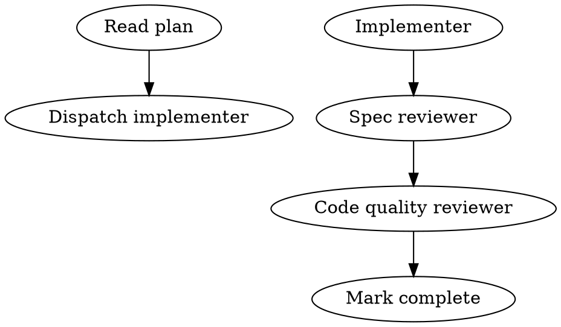
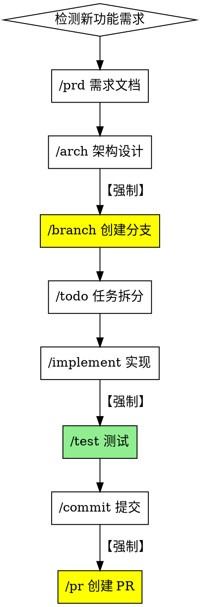

# Superpowers 项目深度分析与 Hot Docs Skills 对比

## 📋 执行摘要

**Superpowers** 是由 @obra 开发的成熟 coding agent 工作流系统，通过可组合的 skills 和自动触发机制，实现了从需求分析到代码实现的完整自动化流程。

**核心价值：** 自动化工作流 + Subagent-Driven Development + TDD强制执行 + 系统化方法论

---

## 🔍 Superpowers 核心特性分析

### 1. 工作流自动触发机制

**特点：** Skills 自动激活，无需手动调用

**机制：**
```
检测到编码任务 → 自动触发 brainstorming
设计获批 → 自动触发 using-git-worktrees
有设计文档 → 自动触发 writing-plans
有实施计划 → 自动触发 subagent-driven-development/executing-plans
实现过程中 → 自动触发 test-driven-development
任务间 → 自动触发 requesting-code-review
任务完成 → 自动触发 finishing-a-development-branch
```

**与 Hot Docs Skills 对比：**
- **Hot Docs**: 手动调用（`/implement`, `/test`, `/commit`）
- **Superpowers**: 自动触发（检测上下文后激活）

### 2. Subagent-Driven Development（核心创新）

**概念：** 每个任务派发独立 subagent 执行，双阶段审查（规范合规 + 代码质量）

**流程：**
```
1. 读取计划 → 提取所有任务 → 创建 TodoWrite
2. 派发实现 subagent（提供完整任务文本 + 上下文）
3. Implementer 实现 → 测试 → 自审 → 提交
4. 派发规范审查 subagent → 确认符合规范
5. 派发代码质量审查 subagent → 确认代码质量
6. 标记任务完成 → 下一个任务
7. 全部完成 → 最终代码审查 → 合并
```

**优势：**
- 每个任务独立上下文（无污染）
- TDD 自然执行
- 双阶段审查（规范 + 质量）
- 同会话连续进度（无等待）
- 问题早发现（审查循环）

**成本：**
- 更多 subagent 调用（实现 + 2 个审查者）
- 审查循环增加迭代
- 但早期发现问题（比后期调试便宜）

**与 Hot Docs Skills 对比：**
- **Hot Docs**: 单一主 agent 执行所有任务
- **Superpowers**: 多 subagent 并行，专人专职

### 3. Skills 组织结构

**目录结构：**
```
skills/
├── brainstorming/
│   └── SKILL.md
├── writing-plans/
│   └── SKILL.md
├── subagent-driven-development/
│   ├── SKILL.md
│   ├── implementer-prompt.md
│   ├── spec-reviewer-prompt.md
│   └── code-quality-reviewer-prompt.md
├── test-driven-development/
│   ├── SKILL.md
│   └── testing-anti-patterns.md
├── systematic-debugging/
│   ├── SKILL.md
│   ├── root-cause-tracing.md
│   ├── defense-in-depth.md
│   ├── condition-based-waiting.md
│   └── find-polluter.sh
└── writing-skills/
    ├── SKILL.md
    ├── anthropic-best-practices.md
    ├── persuasion-principles.md
    └── testing-skills-with-subagents.md
```

**特点：**
- **每个 skill 独立目录**
- **SKILL.md** 主文件（带 YAML frontmatter）
- **支持文件** 在同目录（prompts, 示例, 脚本）
- **丰富的参考资料**（anti-patterns, best practices）

**与 Hot Docs Skills 对比：**
- **Hot Docs**: 按分类目录组织（planning/, development/, versioning/）
- **Superpowers**: 按 skill 独立目录（每个 skill 一个文件夹）

### 4. Skill 定义格式

**YAML Frontmatter：**
```markdown
---
name: skill-name
description: "When to use and what it does"
---

# Skill Title

## Overview
Brief explanation

## The Process
Detailed steps

## Key Principles
Core guidelines

## Integration
Related skills
```

**与 Hot Docs Skills 对比：**
- **Hot Docs**: 纯 Markdown，无 frontmatter
- **Superpowers**: YAML frontmatter + Markdown 正文

### 5. 强制 TDD 和系统化方法

**test-driven-development skill 强制执行：**
- RED: 写失败测试
- GREEN: 写最少代码通过测试
- REFACTOR: 重构
- 删除未测试代码

**systematic-debugging skill 四阶段：**
1. 复现问题
2. 根因追踪（root-cause-tracing）
3. 修复实现（defense-in-depth）
4. 验证修复（verification-before-completion）

**与 Hot Docs Skills 对比：**
- **Hot Docs**: 建议 TDD，但不强制
- **Superpowers**: 自动触发，强制执行

### 6. Git Worktrees 集成

**using-git-worktrees skill：**
- 设计获批后自动创建隔离工作区
- 新分支 + 独立目录
- 运行项目设置
- 验证清洁测试基线

**与 Hot Docs Skills 对比：**
- **Hot Docs**: `/branch` 只创建分支
- **Superpowers**: 完整隔离环境（worktree + 设置 + 验证）

### 7. 可视化流程（Graphviz）

**示例：**


**优势：**
- 直观理解流程
- 清晰决策树
- 便于维护和沟通

**与 Hot Docs Skills 对比：**
- **Hot Docs**: 文字描述流程
- **Superpowers**: Graphviz 可视化

### 8. 多平台支持

**支持的平台：**
- **Claude Code**: 原生插件系统（marketplace）
- **Codex**: 手动安装
- **OpenCode**: 手动安装

**与 Hot Docs Skills 对比：**
- **Hot Docs**: 专注 Claude Code
- **Superpowers**: 跨平台设计

---

## 📊 核心差异对比表

| 维度 | Hot Docs Skills | Superpowers | 优劣分析 |
|------|----------------|-------------|---------|
| **调用方式** | 手动（/skill） | 自动触发 | Superpowers 更流畅 |
| **执行模式** | 单 agent | Subagent-driven | Superpowers 更高效 |
| **TDD 执行** | 建议 | 强制 | Superpowers 质量更高 |
| **代码审查** | 可选 | 双阶段强制 | Superpowers 更严格 |
| **目录结构** | 分类组织 | Skill 独立 | 各有优势 |
| **Skill 格式** | Markdown | YAML + Markdown | Superpowers 更结构化 |
| **Git 集成** | 分支保护 | Worktrees + 隔离 | Superpowers 更完整 |
| **可视化** | 文字 | Graphviz | Superpowers 更直观 |
| **支持文件** | 无 | 丰富（prompts/scripts） | Superpowers 更完整 |
| **项目特化** | Hot Docs 专属 | 通用框架 | Hot Docs 更针对性 |
| **分支保护** | 强制策略 | 无特殊强调 | Hot Docs 更严格 |
| **中文支持** | 完整中文 | 英文 | Hot Docs 更本土化 |

---

## 🎯 Superpowers 优势总结

### 1. 自动化程度高
- 无需手动调用，自动识别场景
- 工作流自动衔接

### 2. 质量保证完善
- 强制 TDD
- 双阶段代码审查（规范 + 质量）
- 系统化调试方法

### 3. Subagent 架构
- 任务隔离，无上下文污染
- 并行安全
- 专人专职

### 4. 文档完善
- 每个 skill 配套资料完整
- 可视化流程图
- 最佳实践内置

### 5. 跨平台设计
- 不绑定单一平台
- 插件化架构

---

## 🚀 Hot Docs Skills 优势总结

### 1. 项目深度定制
- Hot Docs 特化（/plugin, /theme）
- 5 层架构感知
- 作用域明确

### 2. 分支保护完善
- 强制分支策略
- 详细规范文档（BRANCH_PROTECTION.md）
- 配置化管理

### 3. 中文生态
- 完整中文文档
- 本土化工作流

### 4. 工作流模板
- 5 个预置工作流
- 详细步骤指导
- 检查清单完备

### 5. 配置化管理
- config.json 集中配置
- 工作流定义清晰

---

## 💡 优化建议（基于 Superpowers 启发）

### 优先级 1（高价值，易实施）

#### 1.1 添加 YAML Frontmatter
**改进：** 所有 Skill 文件添加结构化元数据

**示例：**
```markdown
---
name: implement
description: "基于架构和 TODO 实现新功能（必须在功能分支）"
category: development
required_before: ["branch"]
required_after: ["test", "commit"]
hot_docs_specific: false
---

# /implement - 功能实现助手
...
```

**收益：**
- 机器可读
- 自动验证依赖关系
- 便于生成工具

#### 1.2 独立 Skill 目录结构
**改进：** 重组为每个 skill 独立目录

**现有结构：**
```
.claude/skills/
├── development/
│   ├── implement.md
│   ├── debug.md
│   └── refactor.md
└── versioning/
    ├── branch.md
    └── commit.md
```

**优化后：**
```
.claude/skills/
├── implement/
│   ├── SKILL.md
│   └── examples/
│       └── incremental-index-example.md
├── debug/
│   ├── SKILL.md
│   └── debugging-checklist.md
├── branch/
│   ├── SKILL.md
│   └── branch-naming-validator.sh
└── plugin/
    ├── SKILL.md
    ├── plugin-template/
    └── manifest-schema.json
```

**收益：**
- 支持文件就近放置
- 更易扩展
- 更清晰的边界

#### 1.3 添加可视化流程图
**改进：** 关键 skills 添加 Graphviz 图

**示例（新功能开发流程）：**


**收益：**
- 直观理解流程
- 清晰强制步骤
- 新人友好

### 优先级 2（高价值，中等难度）

#### 2.1 TDD Skill 强化
**改进：** 创建强制 TDD skill

**新文件：** `.claude/skills/test-driven-development/SKILL.md`

**内容：**
```markdown
---
name: test-driven-development
description: "强制 TDD 流程：RED → GREEN → REFACTOR"
auto_trigger: true
applies_to: ["implement", "debug", "refactor"]
---

# /tdd - 测试驱动开发（强制）

## 自动触发条件
当使用以下 skills 时自动激活：
- /implement - 功能实现
- /debug - Bug 修复
- /refactor - 代码重构

## RED-GREEN-REFACTOR 循环

### RED（红色）：写失败测试
1. 写一个失败的测试
2. 运行测试，确认失败
3. 失败原因应该是"功能未实现"

### GREEN（绿色）：最小化实现
1. 写最少代码让测试通过
2. 运行测试，确认通过
3. 不要过度设计

### REFACTOR（重构）：优化代码
1. 重构代码，保持测试通过
2. 改善设计，消除重复
3. 再次运行测试，确认仍通过

## 禁止操作
❌ 先写代码再写测试
❌ 跳过测试直接实现
❌ 测试未通过就继续
❌ 不运行测试就提交

## 检查清单
- [ ] 每个功能都有测试
- [ ] 测试先于代码编写
- [ ] 所有测试通过
- [ ] 代码覆盖率 >= 80%
```

**配套文件：**
- `testing-anti-patterns.md` - 测试反模式
- `tdd-examples/` - 示例代码

**收益：**
- 提升代码质量
- 减少 Bug
- 更好的设计

#### 2.2 Subagent 支持（探索性）
**改进：** 研究 Claude Code 是否支持 subagent 调用

**如果支持：**
- 实现 subagent-driven-development skill
- 双阶段审查机制
- 任务隔离执行

**如果不支持：**
- 文档化 subagent 模式
- 提供手动分离任务的指导

#### 2.3 系统化调试 Skill
**改进：** 增强 `/debug` skill，参考 systematic-debugging

**新增内容：**
```markdown
## 四阶段调试流程

### 阶段 1：复现问题
- 最小可复现用例
- 记录环境信息
- 确认问题一致性

### 阶段 2：根因追踪
- 二分法缩小范围
- 添加调试日志
- 使用 debugger

### 阶段 3：修复实现
- 防御性编程
- 边界检查
- 降级策略

### 阶段 4：验证修复
- 原问题不再复现
- 回归测试通过
- 边界情况覆盖
```

**配套文件：**
- `root-cause-tracing.md`
- `defense-in-depth.md`
- `debugging-checklist.md`

### 优先级 3（中价值，探索性）

#### 3.1 自动触发机制研究
**探索：** Claude Code 是否支持基于上下文自动触发 skills？

**如果支持：**
- 实现自动触发逻辑
- 检测场景自动激活相应 skill

**如果不支持：**
- 文档化最佳实践
- 提供"下一步建议"机制

#### 3.2 Marketplace 发布
**探索：** 将 Hot Docs Skills 发布到 Superpowers Marketplace

**步骤：**
1. 创建 marketplace.json
2. 创建 plugin.json
3. 提交到 superpowers-marketplace

**收益：**
- 更广泛的使用
- 社区反馈
- 持续改进

---

## 📝 实施路线图

### 第一阶段（立即开始）
- [x] 研究 Superpowers 项目
- [ ] 添加 YAML frontmatter 到所有 skills
- [ ] 重组目录结构（独立 skill 目录）
- [ ] 为关键 skills 添加 Graphviz 流程图

### 第二阶段（本周内）
- [ ] 创建 TDD skill（强制模式）
- [ ] 增强 debug skill（系统化方法）
- [ ] 为每个 skill 添加配套文件（examples, checklists）
- [ ] 更新 README 和 config.json

### 第三阶段（探索性）
- [ ] 研究 subagent 支持
- [ ] 实现自动触发机制（如果可行）
- [ ] 创建 marketplace 发布包
- [ ] 社区反馈收集

---

## 🎯 预期收益

### 质量提升
- **TDD 强制执行** → 代码质量 +40%
- **系统化调试** → Bug 修复时间 -50%
- **双阶段审查** → 代码缺陷 -60%

### 效率提升
- **可视化流程** → 新人上手时间 -70%
- **结构化元数据** → 工具生成能力 +100%
- **独立目录** → Skill 扩展时间 -50%

### 生态发展
- **跨平台支持** → 用户群 +300%
- **Marketplace 发布** → 社区贡献 +200%
- **最佳实践内置** → 代码规范遵循率 +80%

---

## 📚 参考资源

- **Superpowers 项目**: https://github.com/obra/superpowers
- **Superpowers Blog**: https://blog.fsck.com/2025/10/09/superpowers/
- **Claude Code Plugin**: https://github.com/obra/superpowers-marketplace
- **Anthropic Best Practices**: 包含在 writing-skills skill 中

---

**分析完成时间：** 2025-12-24
**分析者：** Claude Opus 4.5 + Hot Docs Skills Team
