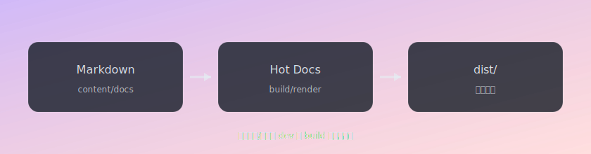

# 资源与附件

在 Markdown 中可以直接使用相对路径引用图片/附件，dev 与 build 会保持一致。

## 图片（SVG 示例）

下面这张图来自相对路径 `./assets/diagram.svg`：

## 附件（文本文件示例）

- [下载示例文件](./assets/sample.txt)

## 站内链接重写示例

从这里跳到：[配置说明](./config.md)

