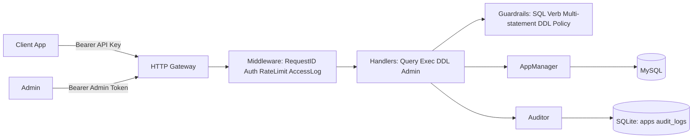

# 云数据库接入网关（cloud-data-proxy）技术架构深度分析与评分（2026-02-06）

> 评估对象：`/Users/Zhuanz/work-space/cloud-data-proxy` 代码仓库当前实现。  
> 评估时间：2026 年 2 月 6 日。  
> 目标：给出“当前能否稳定支撑生产”的技术结论、量化评分与优先级风险。

## 1. 评估范围与方法

### 1.1 评估范围

- 服务入口与生命周期管理（启动、依赖初始化、优雅停机）
- API 与中间件链路（鉴权、限流、审计、错误处理）
- 数据层（MySQL 访问、SQLite 元数据、迁移）
- 多租户隔离策略（应用级身份与数据库作用域）
- 运维与部署（systemd、部署脚本、配置管理）
- 工程质量（测试、静态检查、文档一致性）

### 1.2 评分模型

- 采用 7 个维度，总分 10 分，按权重加权。
- 同时给出三种分数：
  - `MVP 可用性`：面向小规模上线的可行性
  - `生产就绪度`：面向稳定生产运营
  - `综合评分`：综合平衡后的总体判断

## 2. 系统定位与边界

该项目是一个单机部署的 HTTP 数据网关，面向“应用不直连数据库”的治理场景：

- 管理平面：`/admin/*`
  - 创建应用
  - 启用/禁用
  - 轮换 API Key
- 数据平面：`/v1/query`、`/v1/exec`、`/v1/ddl`
  - 读写能力统一收口
  - 通过网关施加限流、护栏、审计

核心目标已经实现为可运行闭环；当前不足主要集中在“生产级隔离可靠性、回滚一致性、测试覆盖”。

## 3. 架构全景

## 4. 分层架构分析

### 4.1 启动与依赖装配

优点：

- 入口清晰，依赖注入路径明确：配置 -> SQLite -> MySQL -> Router。
- 支持优雅停机，具备生产基础。
- 默认 JSON 结构化日志，利于后续接入日志平台。

风险：

- 审计、配置、数据层全部强耦合在单进程，暂无降级路径。

结论：`工程结构清晰，单机可用`。

### 4.2 API 网关层（路由 + 中间件）

优点：

- 管理面与数据面边界清楚。
- 已具备关键中间件：应用鉴权、全局限流、按应用限流、DDL 限流、访问日志、RequestID。
- `/healthz` 与 `/readyz` 基础探针完备。

风险：

- 目前日志字段偏“请求级”，缺少更细粒度指标埋点（队列长度、池等待、分错误码统计）。

结论：`网关层达成 MVP 标准，观测维度需增强`。

### 4.3 数据访问层（MySQL 与 AppManager）

优点：

- 支持共享 DSN 与每应用独立库（自动开通）两种模式。
- 连接池参数可配置，便于调优。

风险：

- 当 `AUTO_PROVISION_APP_USER=false` 时，会回落为管理账号连接应用库；若 SQL 作用域校验被绕过，隔离强度显著下降。
- AppManager 的连接池缓存策略仅按 `app_id` 本地内存缓存，未考虑多实例一致性。

结论：`具备多租户雏形，但当前隔离“强度依赖实现细节”`。

### 4.4 元数据与审计层（SQLite）

优点：

- migration 机制简洁可控。
- 审计字段较完整，且默认存 `sql_hash`，不落明文 SQL。

风险：

- SQLite 单连接 + 同步写审计，在高并发下会成为吞吐瓶颈。
- 缺少审计归档与生命周期策略。

结论：`单机场景可用，规模扩展前需改造`。

## 5. 安全与隔离深度评估

### 5.1 已实现的安全能力

- Admin 与 App 双鉴权路径。
- API Key 采用 HMAC Hash 存储，明文仅一次返回。
- DDL 增加 `ddl_ack` 与 `change_reason` 强约束。
- 高危 DDL 关键词 deny-list（可配置）。
- 应用数据库密码支持 AES-GCM 加密存储（独立用户模式）。

### 5.2 核心短板（生产关键）

1. `SQL 作用域校验依赖正则启发式`  
   - 可能误判（误伤合法 SQL）或漏判（绕过跨库检查）。
2. `开通流程非事务化`  
   - “创建 app”与“创建库/用户授权”分步执行，失败时可能残留半成品状态。
3. `密钥管理流程未完全生产化`  
   - 模板治理与部署策略还需统一，避免环境文件误填或明文传播。

结论：`安全基础可用，但尚未达到严格生产级隔离与变更一致性标准`。

## 6. 性能与扩展性评估

### 6.1 当前能力

- 连接池、请求超时、全局/租户限流、响应大小限制均已具备。
- 对中小规模流量（单机 + 单库）有较好可控性。

### 6.2 扩展瓶颈

- 限流与租户状态都在本地内存，天然单机语义。
- 同步审计写入 + SQLite 单写者模型，不适合高 QPS 审计场景。
- 暂无异步化和批量化通道（审计、慢查询、事件）。

结论：`可支撑当前目标规模，但不适合直接横向扩展`。

## 7. 运维与可观测性评估

优点：

- 已提供 systemd 单元与一键部署脚本，落地速度快。
- 启停和基础健康检查可直接纳入运维流程。

短板：

- 缺少 Prometheus/OpenTelemetry 指标标准化导出。
- 运行账号与最小权限策略仍需补强（service user、文件权限、网络策略）。
- 缺少面向事故的 Runbook 与回滚机制文档。

## 8. 工程质量评估

### 8.1 当前验证状态（2026-02-06）

- `go test ./...`：通过编译，但各包均无测试文件（`[no test files]`）。
- `go vet ./...`：通过。

### 8.2 质量结论

- 代码结构可读性较好，模块职责清晰。
- 但自动化测试覆盖为空，是生产化最大工程风险之一。

## 9. 量化评分

| 维度 | 权重 | 得分（10） | 说明 |
|---|---:|---:|---|
| 架构分层与可维护性 | 20% | 8.2 | 包结构清晰、职责边界明确 |
| 安全与租户隔离 | 20% | 5.8 | 基础鉴权完整，隔离可靠性仍偏弱 |
| 稳定性与容错 | 15% | 6.5 | 有限流/超时/健康检查，缺少流程回滚 |
| 性能与扩展性 | 15% | 6.2 | 单机可用，审计与限流机制限制扩展 |
| 可运维性 | 10% | 6.8 | 有部署骨架，缺体系化观测与运行基线 |
| 可测试性 | 10% | 2.0 | 无单测/集成测试 |
| 文档一致性 | 10% | 6.0 | 需求/设计/实现存在部分偏差 |
| **综合评分** | **100%** | **6.2** | **MVP 可用，生产需重点补课** |

### 9.1 三种结论分

- `MVP 可用性评分`：**7.8/10**
- `生产就绪度评分`：**5.6/10**
- `综合评分`：**6.2/10**

## 10. 主要风险清单（按优先级）

### P0（必须先改）

1. SQL 作用域隔离可靠性不足（误判/漏判风险并存）。
2. 应用创建与数据库开通缺少事务化编排和失败回滚。
3. 在回落管理员账号模式下，隔离强度依赖 SQL 文本校验。

### P1（建议紧随其后）

1. 无自动化测试，变更回归风险高。
2. 审计同步写路径在高并发下会放大尾延迟。
3. OpenAPI、配置模板与实际行为需要持续对齐。

### P2（中期优化）

1. 观测指标体系（metrics/tracing）不足。
2. 多实例情况下的限流与状态一致性缺口。
3. 缺少标准化运行手册（故障分级、回滚、值班手册）。

## 11. 结论与建议

### 11.1 架构定位结论

当前实现是一个“可运行、可部署、可审计”的高质量 MVP 骨架，适合单机中小规模场景试运行。

### 11.2 生产建议

如需进入稳定生产，建议采用以下门槛：

- 先完成 P0（隔离与一致性）后再做灰度。
- 同步推进测试与观测基线建设（P1），避免“可运行但不可控”。
- 在单机稳定后再考虑多实例扩容，避免过早复杂化。

## 12. 附录：评估结论对应的证据索引

- 启动与依赖装配：`cloud-data-proxy/cmd/gateway/main.go`
- 路由与中间件：`cloud-data-proxy/internal/http/router.go`
- 数据接口链路：`cloud-data-proxy/internal/http/handlers/data.go`
- 管理接口与开通逻辑：`cloud-data-proxy/internal/http/handlers/admin.go`
- SQL 护栏：`cloud-data-proxy/internal/guard/guard.go`
- 应用连接池管理：`cloud-data-proxy/internal/db/app_manager.go`
- 自动开库/开用户：`cloud-data-proxy/internal/db/provisioner.go`
- 审计写入：`cloud-data-proxy/internal/audit/audit.go`
- SQLite 迁移：`cloud-data-proxy/internal/store/store.go`
- systemd 配置：`cloud-data-proxy/deploy/systemd/cloud-data-proxy.service`
- 部署脚本：`cloud-data-proxy/scripts/deploy.sh`
