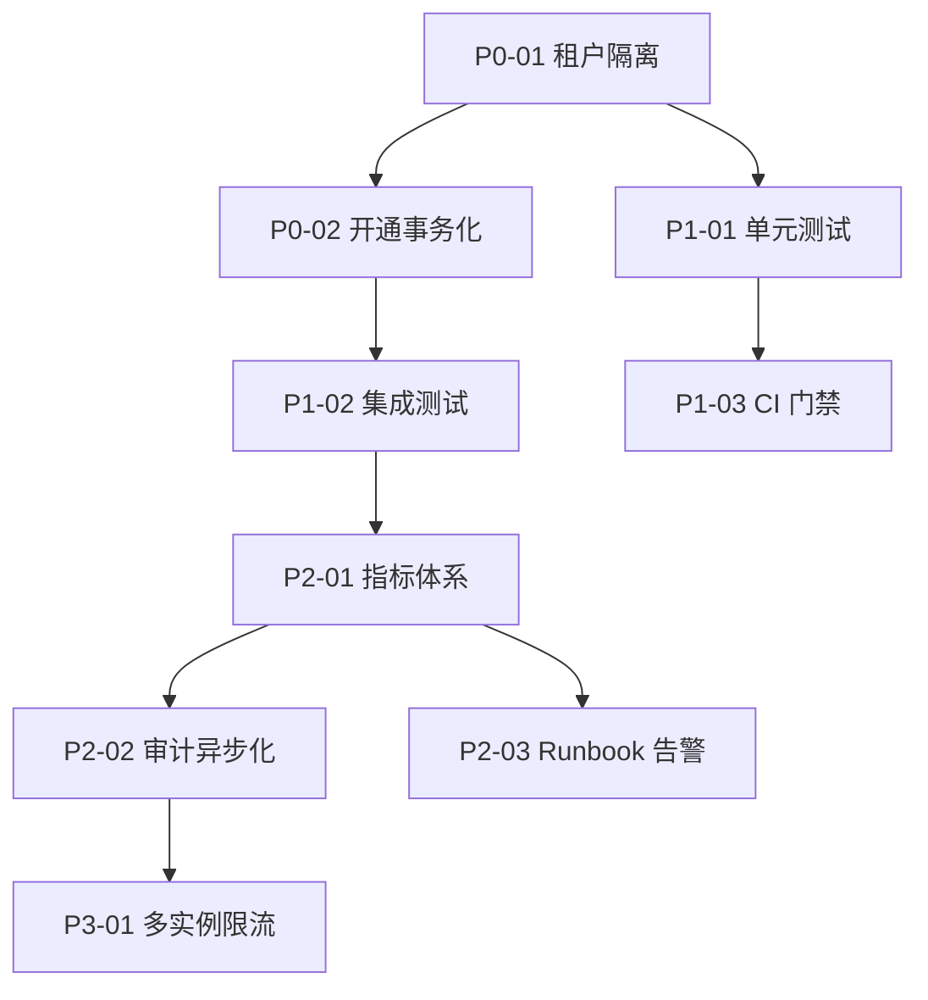

# 云数据库接入网关生产化改造清单（含预计工时与改造顺序）

> 适用对象：`/Users/Zhuanz/work-space/cloud-data-proxy` 当前实现。  
> 制定日期：2026 年 2 月 6 日。  
> 目标：给出可执行的生产化路线，明确“先做什么、后做什么、每项要多久”。

## 0. 估算前提

为避免工时口径失真，本清单使用如下前提：

- 估算单位：`人日（PD）`，1 PD = 1 名工程师 1 个工作日。
- 角色配置（建议）：
  - 后端工程师：1~2 人（主力）
  - SRE/运维：0.5 人（并行支持）
  - 测试：0.5 人（集成与回归）
- 工时口径包含：设计、开发、联调、文档、回归，不包含等待跨团队审批时间。

## 1. 生产化总体顺序（必须遵循）

改造顺序说明：

1. **先做 P0**：先消除越权与不一致风险，再考虑性能优化。
2. **再做 P1**：没有测试和 CI 门禁，后续所有优化都不可控。
3. **随后 P2**：先可观测，再谈稳定运营。
4. **最后 P3**：在业务增长明确后投入扩展性工程。

## 2. 改造清单（含工时）

## 2.1 P0：安全隔离与一致性（最高优先级）

| 编号 | 任务 | 目标与产出 | 依赖 | 预计工时 |
|---|---|---|---|---:|
| P0-01 | 强化租户隔离策略 | 以“连接凭据隔离”为主、SQL 文本校验为辅；消除跨库误判/漏判关键路径 | 无 | 4~6 PD |
| P0-02 | 应用开通流程事务化/Saga 化 | 创建应用与开库/授权失败时可回滚，避免半成品租户 | P0-01 | 3~5 PD |
| P0-03 | 敏感配置治理 | 统一模板与运行时密钥策略（占位符校验、启动前自检、敏感信息脱敏） | 无 | 2~3 PD |
| P0-04 | 大写操作保护前置化 | 对高风险 DML 增加显式确认与前置阻断策略，避免“执行后才报错” | 无 | 2~3 PD |
| P0-05 | 运行权限收敛 | systemd 改为专用低权限用户、目录权限最小化、网络白名单建议 | P0-03 | 1~2 PD |

**P0 小计：12~19 PD**

### P0 验收标准

- 不存在已知可复现的跨租户访问路径。
- `create app` 全流程失败可回滚（或自动补偿），不会遗留“激活但不可用”的租户。
- 启动时若关键密钥未配置，服务必须 fail-fast。
- 高风险 DML 必须在执行前被策略阻断或要求明确确认。

## 2.2 P1：测试体系与发布门禁

| 编号 | 任务 | 目标与产出 | 依赖 | 预计工时 |
|---|---|---|---|---:|
| P1-01 | 单元测试基线 | 覆盖 guard、鉴权、作用域校验、错误码映射、配置边界 | P0 完成 | 4~6 PD |
| P1-02 | 集成测试（含 MySQL） | 覆盖 query/exec/ddl 端到端，含超时、限流、回滚路径 | P1-01 | 3~5 PD |
| P1-03 | CI 质量门禁 | PR 强制通过 `go test`、`go vet`、基础 lint，失败禁止合并 | P1-01 | 1~2 PD |
| P1-04 | API 契约同步 | OpenAPI 与真实行为对齐，补齐错误码与字段约束 | P1-02 | 1~2 PD |

**P1 小计：9~15 PD**

### P1 验收标准

- 核心包具备可执行测试；关键路径失败场景被覆盖。
- CI 对主干分支形成硬门禁。
- 文档示例与实际返回结构一致。

## 2.3 P2：可观测性与运行稳定性

| 编号 | 任务 | 目标与产出 | 依赖 | 预计工时 |
|---|---|---|---|---:|
| P2-01 | 指标体系落地 | 暴露请求量、延迟、限流、DB 错误、连接池状态等指标 | P1 完成 | 2~3 PD |
| P2-02 | 审计通道异步化 | 审计写入从同步改为异步队列 + 批量写，降低主链路抖动 | P2-01 | 3~5 PD |
| P2-03 | 运行手册与告警 | 产出 Runbook、告警阈值、故障处理流程、回滚步骤 | P2-01 | 2~3 PD |

**P2 小计：7~11 PD**

### P2 验收标准

- 可观测平台可看到核心 SLI（成功率、P95、429、DB_ERROR）。
- 高并发下审计写入不会显著拖慢主请求路径。
- 值班同学可按 Runbook 独立完成常见故障处置。

## 2.4 P3：扩展性与平台化增强（按需）

| 编号 | 任务 | 目标与产出 | 依赖 | 预计工时 |
|---|---|---|---|---:|
| P3-01 | 多实例限流一致性 | 引入共享限流状态（如 Redis），支持横向扩容 | P2 完成 | 3~5 PD |
| P3-02 | 管理面增强 | 增加数据库凭据轮换、重新开通、审计查询管理能力 | P2 完成 | 3~5 PD |
| P3-03 | 容灾与备份策略 | 元数据与审计备份、恢复演练、RTO/RPO 明确化 | P2 完成 | 2~4 PD |

**P3 小计：8~14 PD**

## 3. 关键路径与总工时

### 3.1 必做范围（建议上线前完成）

- 包含：P0 + P1 + P2
- 总工时：**28~45 PD**

### 3.2 完整范围（含平台化增强）

- 包含：P0 + P1 + P2 + P3
- 总工时：**36~59 PD**

### 3.3 日历周期估算

- 1 名后端主力 + 0.5 运维 + 0.5 测试：约 **8~12 周**（必做范围）
- 2 名后端并行 + 0.5 运维 + 0.5 测试：约 **5~8 周**（必做范围）

## 4. 里程碑排期建议（按 2 后端并行）

| 周次 | 里程碑 | 产出 |
|---|---|---|
| Week 1~2 | M1：P0 完成 | 隔离策略升级、开通可回滚、密钥与运行权限治理 |
| Week 3~4 | M2：P1 完成 | 单测+集成测试+CI 门禁+OpenAPI 对齐 |
| Week 5~6 | M3：P2 完成 | 指标与告警、审计异步化、Runbook 完整 |
| Week 7~8 | M4：P3（可选） | 多实例一致性、管理面增强、容灾演练 |

## 5. 任务依赖图（简化）

## 6. 风险与回滚策略

### 6.1 主要实施风险

- 隔离策略改造可能影响既有 SQL 兼容性。
- 测试体系初建阶段可能暴露较多历史边界问题。
- 审计异步化若处理不当，可能出现日志丢失或顺序错乱。

### 6.2 回滚策略

- 所有 P0/P1 改造通过 feature flag 分段发布。
- 保留旧路径与新路径并行观测窗口（建议 1~2 周）。
- 关键变更必须具备“快速回退开关”和“回退脚本”。

## 7. 上线闸门（Go/No-Go）

上线前建议满足以下硬条件：

1. P0、P1、P2 验收项全部通过。
2. 灰度期内关键指标稳定（成功率、P95、429、DB_ERROR）且无持续恶化。
3. 至少一次故障演练通过（包含回滚演练）。
4. 运行手册、值班流程、告警联系人全部到位。

## 8. 建议的执行策略

- 采用“主线稳定 + 小步快跑”方式：每周固定发布窗口。
- 每个里程碑只引入一类主要风险，不把隔离、性能、运维改造混在同一批上线。
- 先把“可控性”做出来，再追求“高性能”和“多实例复杂能力”。

---

如果仅允许做一轮最小生产化冲刺，建议优先执行：`P0-01`、`P0-02`、`P1-01`、`P1-03`、`P2-01`。这是风险下降最快、投入产出比最高的一组组合。
