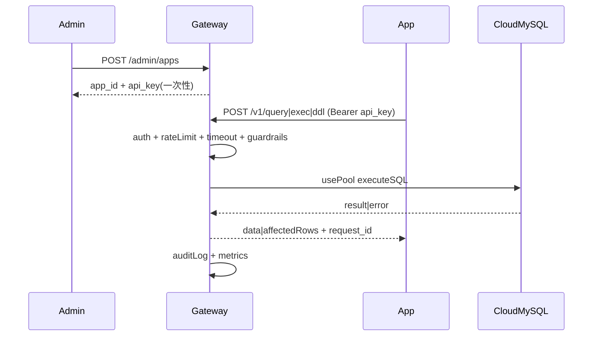

# 云数据库接入系统（HTTP 网关）MVP 需求

> 场景假设：**只有一台服务器**（应用与网关可同机部署）+ **一个云 MySQL**；应用不直连数据库，而是先在系统注册，拿到独立 API Key 后，通过本系统提供的 HTTP API 读写数据库。

## 1. 背景与目标

### 1.1 背景/痛点

- 应用直连数据库时，账号/连接信息分散，难以统一吊销与审计。
- 缺少统一入口后，限流、超时、结果集控制、可观测性难以落地。
- 在单机单库阶段也需要为后续扩展（多应用、权限与治理）预留基本形态。

### 1.2 目标（MVP 必须达成）

- **应用注册与隔离**：每个应用独立身份（`app_id`）与独立 **API Key**，可禁用/轮换。
- **统一数据入口**：提供稳定 HTTP API（读写 + DDL），由系统维护数据库连接池。
- **最小安全与治理**：鉴权、限流、超时、结果限制、写保护（影响行数上限/危险 DDL 默认阻断）。
- **可观测与可审计**：可追溯 “哪个应用在什么时间做了什么操作，耗时与结果如何”。

### 1.3 非目标（刻意不做）

- 不做协议级 MySQL 代理（仍让应用走 MySQL 协议）。
- 不做复杂 RBAC（表/库/行级权限）、不做多租户计费。
- 不做 SQL 改写/优化建议/读写分离/分库分表。
- 不做多实例路由（当前只有一个云数据库）。

## 2. 术语与角色

- **Gateway（本系统）**：对外 HTTP 服务，内部连接云 MySQL。
- **Admin**：管理员，负责应用管理与安全治理。
- **App**：业务应用，持有 API Key 调用数据接口。

## 3. 总体架构与数据流

## 4. 权限与鉴权

### 4.1 应用注册（App）

- **必须**支持创建应用：生成 `app_id` 与 **一次性明文 `api_key`**（只返回一次）。
- **必须**支持禁用应用：禁用后所有请求返回 401/403。
- **必须**支持轮换 Key：旧 Key 立即失效（或提供可配置的过渡期，默认无过渡）。

### 4.2 API Key 鉴权

- Header：`Authorization: Bearer <api_key>`。
- 系统侧仅存储 `api_key_hash`（不可逆哈希），不得明文落盘。

### 4.3 管理端鉴权（Admin）

- MVP：使用静态 `ADMIN_TOKEN`（`Authorization: Bearer <token>`）。
- 要求：日志中不得打印真实 token/key。

## 5. 对外接口（HTTP API）

> 约定：所有响应都应包含 `request_id`（用于串联日志与排障）。

### 5.1 Admin API

- `POST /admin/apps`
  - 入参：`name`
  - 出参：`app_id`、`api_key`（一次性）
- `PATCH /admin/apps/{app_id}`
  - 入参：`status=active|disabled`
- `POST /admin/apps/{app_id}/rotate-key`
  - 出参：新的 `api_key`（一次性）

### 5.2 Data API

#### 5.2.1 查询接口（读）

- `POST /v1/query`
- 入参：
  - `sql`: string（必须参数化，不允许拼接占位）
  - `params`: array（可选）
  - `timeout_ms`: number（可选）
- 出参：
  - `columns`: array
  - `rows`: array
  - `row_count`: number
  - `request_id`: string

#### 5.2.2 执行接口（写：DML）

- `POST /v1/exec`
- 允许：`INSERT/UPDATE/DELETE`（是否允许 `REPLACE`/`TRUNCATE` 由配置决定，默认禁用 `TRUNCATE`）
- 入参：同 `/v1/query`
- 出参：
  - `affected_rows`: number
  - `last_insert_id`: number（如适用）
  - `request_id`: string

#### 5.2.3 DDL 接口（写：DDL）

- `POST /v1/ddl`
- 允许：`CREATE/ALTER/DROP/INDEX` 等（MVP 允许，但必须启用更强保护）
- 入参（在 `/v1/exec` 基础上增加）：
  - `ddl_ack`: boolean（必须为 true，表示调用方明确知晓风险）
  - `change_reason`: string（必须，变更原因）
  - `ticket`: string（可选，工单/变更单号）
- 出参：
  - `ddl_result`: string（如 `ok`/`error`）
  - `request_id`: string

> 建议：如果你不想引入新路径，也可统一使用 `/v1/exec`，通过 `mode=ddl|dml` 区分；但拆分路径更便于限流与审计。

## 6. 保护策略（MVP 必须）

### 6.1 超时与资源上限

- **必须**为每个请求设置最大执行时间（默认 3000–5000ms，可配置）。
- **必须**限制连接池与并发：
  - `DB_MAX_CONNS`（网关→DB）
  - `MAX_INFLIGHT_REQUESTS`（网关层）

### 6.2 限流与配额（最小集）

- **必须**支持全局 QPS 限流。
- **必须**支持按 `app_id` 维度的 QPS 限流。
- **建议**为 DDL 单独更严格的限流（例如 1 QPS 或更低）与并发=1。

### 6.3 结果集/响应大小限制

- **必须**限制查询返回的最大行数与最大响应字节（默认例如：`MAX_ROWS=10000`、`MAX_RESPONSE_BYTES=10MB`）。

### 6.4 写安全（影响行数与危险语句）

- **必须**为 DML 设置影响行数上限（例如 `MAX_AFFECTED_ROWS`，默认 50000，可配置）。
- **必须**对高危 DDL 默认阻断（可配置白名单/开关）：
  - 默认阻断示例：`DROP DATABASE`、`TRUNCATE TABLE`（如业务强依赖可显式放开）。

### 6.5 SQL 注入与参数化

- **必须**只允许参数化执行：`sql` + `params`。
- **必须**记录 `sql_hash` 进行审计（默认不记录原始 SQL；可通过配置允许在受控环境记录明文）。

## 7. 性能与“会不会变慢”

### 7.1 结论

- 会增加一次 **HTTP 网关**处理开销（鉴权/限流/序列化）以及一次应用→网关的请求；
- 在你的场景（**同机部署 + 中等流量**）下，只要**连接池**与**结果限制**到位，网关引入的额外延迟通常是**毫秒级**，不会成为主要瓶颈。

### 7.2 常见变慢根因（需要在需求里约束）

- 未使用连接池导致频繁建连。
- 返回结果集过大导致序列化与网络传输变慢。
- 写操作锁等待/事务过大导致 DB 端慢。

### 7.3 性能目标（先写目标，压测校准）

- **额外开销目标**：网关相对直连的附加延迟 P95 ≤ 5–10ms（同机/同内网条件）。
- **稳定性目标**：在限流触发时可预期失败（429/明确错误码），系统不崩溃且 DB 连接数不失控。

## 8. 可观测与审计（MVP 必须）

### 8.1 日志

- **必须**结构化日志字段至少包含：
  - `request_id`、`app_id`、`endpoint`、`operation=query|exec|ddl`
  - `sql_hash`、`duration_ms`、`row_count/affected_rows`
  - `success`、`error_code`、`error_message`（脱敏）

### 8.2 指标

- **必须**暴露基础指标：
  - 请求量/错误量/限流次数
  - 延迟（P50/P95）
  - DB 连接池：活跃连接数/等待次数（如可获取）

### 8.3 审计查询（可选）

- MVP 可先做到“日志可检索”；若需要产品化，可新增 `GET /admin/audit?app_id=...`。

## 9. 部署与配置

### 9.1 部署形态

- 单机进程或容器均可；推荐通过 systemd 或容器编排保证自启动与日志收集。

### 9.2 健康检查

- `GET /healthz`：进程存活。
- `GET /readyz`：依赖就绪（DB 可连/连接池可用）。

### 9.3 配置项（示例）

- `DB_DSN`（云 MySQL DSN）
- `DB_MAX_CONNS`、`DB_MAX_IDLE_CONNS`
- `DEFAULT_TIMEOUT_MS`、`MAX_TIMEOUT_MS`
- `MAX_ROWS`、`MAX_RESPONSE_BYTES`
- `MAX_AFFECTED_ROWS`
- `ADMIN_TOKEN`
- `RATE_LIMIT_GLOBAL_QPS`、`RATE_LIMIT_PER_APP_QPS`、`RATE_LIMIT_DDL_QPS`

## 10. 验收标准（Acceptance Criteria）

- **注册可用**：创建应用后拿到一次性 `api_key`，可调用 `/v1/query` 与 `/v1/exec` 成功读写。
- **禁用生效**：禁用应用后旧 Key 立刻不可用（401/403），且记录审计。
- **限流/超时可验证**：
  - 超时返回明确错误码；
  - 限流返回 429（或约定码），且计入指标。
- **结果限制生效**：超过 `MAX_ROWS`/`MAX_RESPONSE_BYTES` 时明确失败或截断（按约定），系统稳定。
- **DDL 守护可验证**：
  - 未提供 `ddl_ack=true` 或缺少 `change_reason` 时拒绝执行；
  - 高危语句默认阻断；
  - DDL 请求在审计里可追溯（含 `ticket/change_reason`）。

