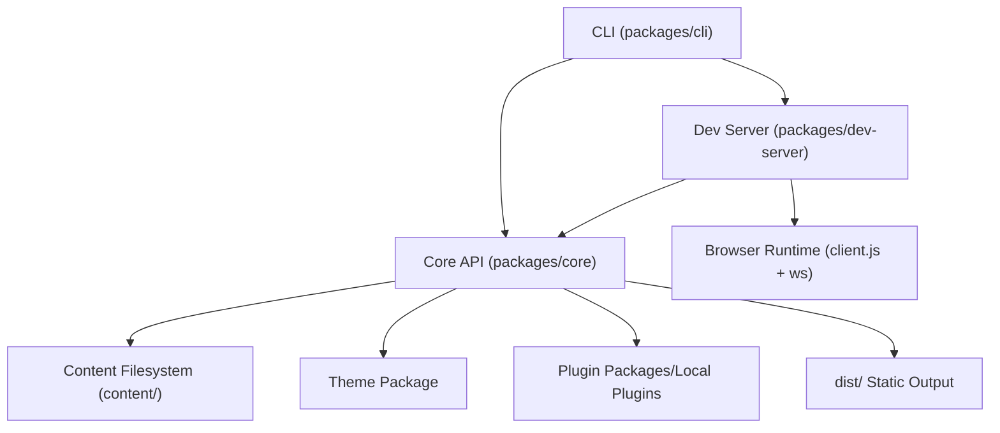
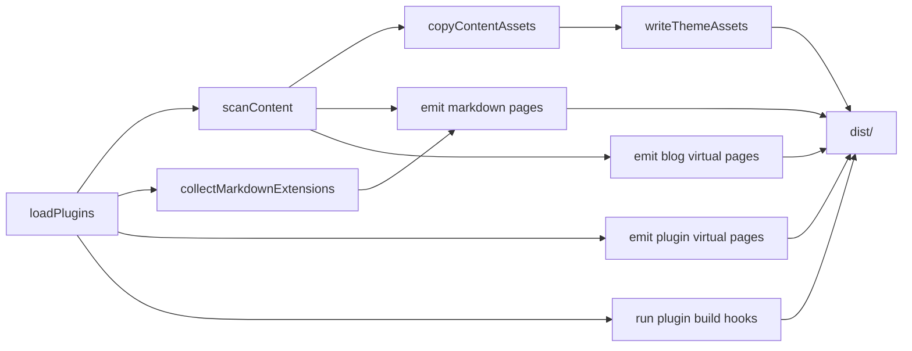

# Hot Docs 当前实现技术架构（源码实况）

> 文档目标：基于当前仓库代码实现，给出可落地、可追踪的架构说明。  
> 适用版本：仓库当前工作区（含 `plugin-ai-pack`、`plugin-ai-ui`）。  
> 对照关系：本文件描述“实现态”；`docs/architecture.md` 描述“目标蓝图态”。

---

## 1. 总体定位

Hot Docs 当前是一个 **TypeScript + Node.js 的静态优先文档系统**，以 Monorepo 组织：

- 内容来源：`content/` 本地 Markdown 与静态资源
- 运行形态：
  - `dev`：Node HTTP + WebSocket + 文件监听（增量更新）
  - `build`：生成 `dist/` 纯静态站点
  - `preview`：本地静态预览服务器
- 扩展形态：Theme 包 + Plugin 包（通过 `package.json#hotDocs` manifest）

核心设计仍保持三条主线：

1. 静态优先（可任意静态部署）
2. `site.base` 一致性（dev/build/preview 一致）
3. 插件化扩展（Markdown、虚拟路由、build hook）

---

## 2. Monorepo 结构与职责划分

### 2.1 包结构

- `packages/core`：内容扫描、Markdown 渲染、路由工具、构建器、主题加载器、插件加载器
- `packages/dev-server`：开发服务器、WS 协议、增量更新、浏览器端壳与 overlay
- `packages/cli`：命令入口（`dev/build/preview/init/new`）
- `packages/plugin-*`：官方示例插件能力
- `packages/theme-neon-dark`：示例主题包

### 2.2 非包目录

- `content/`：站点内容与资源（单一事实源）
- `scripts/`：构建、部署、同步、服务器初始化脚本
- `tests/`：Node 内置 `node:test` 回归测试
- `docs/adr/`：关键架构决策记录（静态优先、主题契约、插件契约）

---

## 3. 分层架构（实现态）

### 3.1 CLI 层（编排层）

职责：
- 参数解析与命令分发
- 启动 dev server
- 调用静态构建
- 启动 preview 服务器
- 初始化项目骨架、创建文档/文章模板

关键实现点：
- 自动向上探测项目根（配置文件、`.git`、`pnpm-workspace.yaml`）
- `preview` 严格按 `site.base` 做路径判定与回退

### 3.2 Core 层（内容与构建内核）

职责：
- 配置加载与校验
- 内容扫描与索引构建
- Markdown 渲染与 URL 安全重写
- docs 导航树构建
- blog 虚拟页面构建
- 主题 CSS 聚合
- 插件加载与构建阶段 hook 执行
- 静态站点落盘

### 3.3 DevServer 层（开发时适配）

职责：
- 提供页面壳、JSON payload、nav 数据、theme 样式
- 监听文件变化并增量更新内存索引
- 通过 WS 通知浏览器局部刷新
- 提供 overlay 诊断信息（错误/耗时/最近事件）

### 3.4 Plugin / Theme 生态层

职责：
- Theme：通过 manifest 暴露 CSS
- Plugin：通过 manifest 暴露入口，参与 markdown/routes/build 阶段

---

## 4. 配置模型与生命周期

### 4.1 配置来源与加载顺序

默认配置文件候选：

1. `hot-docs.config.json`
2. `hot-docs.config.mjs`
3. `hot-docs.config.js`
4. `hot-docs.config.cjs`

规则：
- 未找到配置文件则使用 `DEFAULT_CONFIG`
- `.ts` 配置文件不直接支持（显式报错）
- `contentDir` 在加载后会被解析为绝对路径
- `site.base` 统一归一化为以 `/` 开头且以 `/` 结尾
- collection 的 `routeBase` 归一化为无尾斜杠（根路由保留 `/`）

### 4.2 配置校验策略

校验分两级：

- `validateConfigOverride`：检查用户覆写格式与字段类型
- `validateConfigMerged`：检查合并后的最终结构是否完整可用

已覆盖关键字段：

- `contentDir`
- `collections.<id>.{dir,routeBase,type}`
- `site.{title,base}`
- `dev.{port,host,open,includeDrafts,strictPort}`
- `theme.{name,tokens}`
- `plugins[]`（字符串或 `{name|path, options}`）

---

## 5. 内容索引模型（ContentIndex）

核心模型：

- `ContentEntry`
  - 标识：`id`、`collection`、`relativePath`、`routePath`
  - 元数据：`title`、`description`、`summary`、`cover`、`coverAlt`
  - 分类：`tags`、`categories`、`category(legacy)`
  - 时间：`date`、`updated`、`mtimeMs`
  - 状态：`draft`
  - 指纹：`hash`（sha1 截断 12 位）

- `ContentIndex`
  - `entriesByRoute: Map<routePath, ContentEntry>`
  - `entriesById: Map<id, ContentEntry>`
  - `navTreeByCollection: Map<collectionId, NavNode>`

### 5.1 扫描规则

- 遍历每个 collection 目录
- 只识别 `.md/.markdown`
- 忽略隐藏目录/文件（名称以 `.` 开头）
- 支持 `includeDrafts` 控制草稿收录

### 5.2 Frontmatter 归一化细节

- `title`：frontmatter 优先，其次正文首个 `#`，再退回文件名
- `tags/categories/aliases`：支持 string 或 array，自动 trim + 去重
- `category`：兼容老字段，同时回填到 `categories` 体系

---

## 6. Markdown 渲染管线

当前渲染链：

1. `gray-matter` 去 frontmatter
2. `remark-parse`
3. `remark-gfm`
4. 插件注入 `remarkPlugins`
5. `remark-rehype`（禁用危险 HTML）
6. `rehype-slug`
7. 内置 TOC 收集（只收集 H2~H6）
8. `rehype-autolink-headings`
9. 插件注入 `rehypePlugins`
10. URL 重写插件（有 config+entry+filePath 时启用）
11. `rehype-stringify`

### 6.1 URL 重写与安全

能力：

- 站内 Markdown 链接（`.md`）重写为站点路由链接（含 `site.base`）
- 相对资源路径重写为站内可访问 URL
- 绝对站内路径自动 `base` 重写（已带 base 前缀时避免重复重写）
- `javascript:` / `vbscript:` 拦截：
  - `href` -> `#`
  - `src`/`srcset` -> `about:blank`
- 路径越界保护：不允许逃逸 collection 根目录

---

## 7. Blog 虚拟页面系统（Core 内建）

对于 `type=blog` 的 collection，Core 自动生成虚拟页面：

- `/blog`（列表，支持分页 `/blog/page/N`）
- `/blog/tags` 与 `/blog/tags/<tag>`
- `/blog/categories` 与 `/blog/categories/<category>`
- `/blog/archive`

关键机制：

- 排序：优先 `updated/date`，否则 `mtimeMs`
- 封面图 URL 安全重写（支持相对/绝对/外链，拦截不安全 scheme）
- 生成页面 hash（用于 dev 变更 diff 与 WS 推送）

冲突策略：
- 若同路由存在真实 Markdown 页，真实页优先，虚拟页跳过

---

## 8. 静态构建架构（build）

### 8.1 构建顺序（当前实现）

1. 清理输出目录（可关闭）
2. 加载插件
3. 扫描内容索引
4. 拷贝非 Markdown 资源
5. 写入主题 CSS（`dist/assets/theme.css`）
6. 输出真实 Markdown 页面
7. 输出插件虚拟页面
8. 输出 Blog 虚拟页面
9. 执行插件 build hooks（如 sitemap/feed/search-index/ai pack）

### 8.2 输出策略

- 路由页统一输出 `dist/<route>/index.html`（根路由为 `dist/index.html`）
- 非 Markdown 资源按 `routeBase + 相对路径` 保持可访问路径
- 页面模板为内置 MPA shell（sidebar/main/toc）

---

## 9. Dev Server 架构

### 9.1 启动阶段

`startDevServer` 初始化状态：

- 加载配置
- 全量 `scanContent`
- 计算 docs nav hash
- 读取 theme css
- 构建 blog/plugin 虚拟页 map
- 加载插件与 markdown 扩展
- 启动 HTTP + WS + chokidar watcher

### 9.2 HTTP 接口

内置接口：

- `GET /__hot_docs__/client.js`：浏览器运行时脚本
- `GET /__hot_docs__/theme.css`：主题 CSS
- `GET /__hot_docs__/overlay.css`：overlay 样式
- `GET /__hot_docs__/nav`：docs 导航 JSON
- `GET /__hot_docs__/page?route=...`：页面 payload（真实页或虚拟页）

普通路由处理：

- 资源请求：按 collection 映射回 `content/` 实时读取
- 非资源请求：统一返回 HTML 壳，由 `client.js` 再拉取页面数据

### 9.3 WebSocket 协议

事件类型：

- `protocol`
- `doc-changed`
- `doc-removed`
- `nav-updated`
- `overlay-stats`
- `overlay-error`

### 9.4 增量更新算法

文件监听事件（`add/change/unlink`）进入串行队列：

- Markdown 变更：
  - 定位 collection 与旧 entry
  - 重新解析新 entry（或删除 entry）
  - 按需重建 docs nav（标题/顺序/route 变更触发）
  - 计算并广播 blog/plugin 虚拟页 diff
  - 广播文档变更/删除事件
- 非 Markdown：当前直接忽略（不会触发文档级事件）

串行队列保证：
- 并发写入时状态一致性
- overlay 可报告每次更新耗时与最后事件

---

## 10. 浏览器运行时（dev client.js）

职责：

- 拉取 nav 与当前 route 页面 payload
- 替换正文 HTML 并执行内嵌脚本
- 渲染 TOC
- 建立 WS 连接并响应变更事件
- 显示 overlay 状态与错误

行为特征：

- 当前路由收到 `doc-changed` 时局部重新加载
- 当前路由被删除时跳回首页
- nav 更新时仅重拉导航

---

## 11. 主题系统（Theme as Plugin）

### 11.1 合并顺序

最终主题 CSS = `DEFAULT_THEME_CSS + 主题包 CSS + 用户 tokens CSS`

### 11.2 主题包契约

`package.json#hotDocs` 要求：

- `type = "theme"`
- `apiVersion = 1`
- `style = "<css path>"`

### 11.3 当前默认主题特点

- 三栏布局（sidebar/main/toc）
- 暗色霓虹风（`--hd-*` tokens）
- 搜索结果/博客卡片样式内建

---

## 12. 插件系统（Plugin Host）

### 12.1 插件引用方式

`plugins` 支持：

- 包插件：`"@hot-docs/plugin-xxx"` 或 `{name, options}`
- 本地插件：`{path, options}`

### 12.2 包插件契约

`package.json#hotDocs` 要求：

- `type = "plugin"`
- `apiVersion = 1`
- `entry = "<entry path>"`
- `capabilities` 可选

### 12.3 运行时能力点（当前实现）

- `markdown.remarkPlugins/rehypePlugins`
- `routes.pages`（虚拟页面）
- `hooks.build`（构建后写文件）

### 12.4 内置插件矩阵

- `plugin-search`
  - 提供 `/search` 虚拟页
  - build 产出 `search-index.json`
- `plugin-raw-md`
  - build 导出 `__raw__/...` 原 Markdown
  - 渲染期注入“下载 Markdown”链接
- `plugin-ai-pack`
  - build 产出 `ai/manifest.json` + `ai/chunks.json`
- `plugin-ai-ui`
  - 渲染期注入 AI 面板（问答/总结/步骤/翻译）
  - 前端请求外部 API（默认 `/seed`）
- `plugin-sitemap`
  - build 产出 `sitemap.xml`
- `plugin-feed`
  - build 产出 `feed.xml`

---

## 13. CLI 命令架构

支持命令：

- `hot-docs dev`
- `hot-docs build`
- `hot-docs preview`
- `hot-docs init`
- `hot-docs new doc <path>`
- `hot-docs new post <slug>`

实现特点：

- `init` 生成最小 content/config 骨架
- `new doc/post` 带 frontmatter 模板
- `preview` 读取 build 产物并遵守 `site.base`

---

## 14. 产物结构（以当前配置为例）

当前 `dist/` 典型产物：

- 页面：`index.html`、`guide/**/index.html`、`blog/**/index.html`
- 主题：`assets/theme.css`
- 资源：`guide/assets/*`、`blog/assets/*`
- 插件产物：
  - `search-index.json`
  - `__raw__/**`
  - `ai/manifest.json`、`ai/chunks.json`
  - `sitemap.xml`
  - `feed.xml`

---

## 15. 构建与部署链路

### 15.1 构建

- 单包构建：`scripts/build.mjs`（esbuild 打包各 `packages/*/src/index.ts`）
- 站点构建：`pnpm site:build` -> `cli build` -> `core.buildStaticSite`

### 15.2 站点容器化

- `Dockerfile.site`：多阶段构建，最终以 Nginx 托管 `dist/`
- `docker-compose.site.yml`：映射 `8080:80`

### 15.3 自动同步部署

- `scripts/deploy.mjs`：本地 build 后 rsync 到远端
- `scripts/deploy-watch.mjs`：watch + debounce + build + rsync 循环
- `scripts/server-setup.mjs`：远端 nginx 初始化与配置
- `ecosystem.config.cjs`：PM2 运行同步 watcher

---

## 16. 质量保障与工程治理

### 16.1 测试

覆盖点已包含：

- base/path/route 工具函数
- 配置校验
- frontmatter 归一化与 draft 过滤
- docs nav 排序与层级
- TOC 生成
- build 输出路径与 base 注入
- plugin virtual pages / plugin-search / plugin-raw-md
- blog cover URL 安全重写

### 16.2 CI

GitHub Actions（Node 20/22）执行：

1. `pnpm install --frozen-lockfile`
2. `pnpm typecheck`
3. `pnpm test`
4. `pnpm site:build`

---

## 17. 当前架构特征总结（实现视角）

### 17.1 优势

- 从配置到产物的链路完整闭环（dev/build/preview）
- 插件系统已具备最小生态能力（markdown/routes/build）
- Blog 信息架构在 Core 内建，且与静态构建一致
- `site.base` 处理体系较统一（工具函数复用）
- 工程化基础完整（CI、测试、ADR、部署脚本）

### 17.2 当前约束与技术债

1. `dev-server/src/server.ts` 体量较大，协议、渲染壳、增量算法耦合在单文件。  
2. Dev 浏览器运行时以内联字符串维护，可维护性与可测试性一般。  
3. 插件 `capabilities` 目前主要用于声明/透传，尚未形成严格分阶段权限边界。  
4. 增量更新仍为“基于文件重读 + 全量虚拟页重算”的策略，站点规模增大后可能成为瓶颈。  
5. 当前主题系统以 CSS 为主，尚未形成组件级主题契约（布局渲染仍在 core 模板中）。  

---

## 18. 建议的下一步演进（按性价比排序）

1. 拆分 dev-server：`http routes / ws protocol / watcher` 三层模块化。  
2. 将 `client.js` 提升为独立 TS 模块并纳入构建与测试。  
3. 为插件宿主增加分阶段执行统计（耗时、失败率、冲突检测报告）。  
4. 引入构建缓存（按 entry hash）以降低大站点重建成本。  
5. 逐步抽离页面模板层，形成更明确的“渲染壳契约”（为后续主题组件化做准备）。  

---

## 19. 关键源码索引（便于二次阅读）

- 配置加载：`packages/core/src/config/load-config.ts`
- 内容扫描：`packages/core/src/content/scan.ts`
- Markdown 渲染：`packages/core/src/render/markdown.ts`
- URL 重写：`packages/core/src/render/url-rewriter.ts`
- Blog 虚拟页：`packages/core/src/blog/virtual-pages.ts`
- 静态构建：`packages/core/src/build/build.ts`
- 主题加载：`packages/core/src/theme/load-theme.ts`
- 插件加载：`packages/core/src/plugins/load-plugins.ts`
- 开发服务器：`packages/dev-server/src/server.ts`
- CLI：`packages/cli/src/index.ts`

