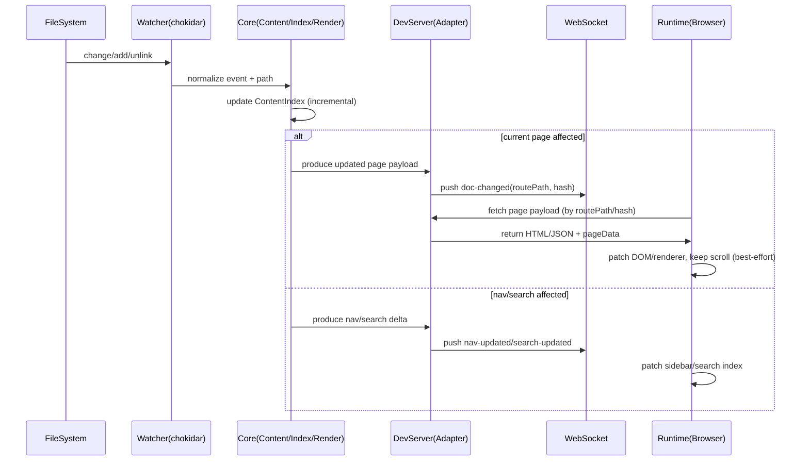

# Hot Docs 架构文档 v2.0

> 本文档将 `Hot Docs` 定位为“开源、静态优先、可任意环境部署”的文档/Blog 系统，并给出可落地的架构分层、模块边界与数据流（dev/build/runtime）。文档不强绑定某个前端框架，但会给出 runtime 与主题/插件的稳定契约。

## 1. 架构目标与设计原则

### 1.1 核心目标
- **静态优先**：默认输出 `dist/` 纯静态站点，可部署到任意静态服务器/对象存储/CDN；SSR 作为可选 adapter。
- **开发体验优先**：目录 watch + 浏览器热更新；错误可视化；插件链可诊断。
- **可扩展、可治理**：主题/插件通过 manifest + `apiVersion` 版本化；能力声明（capabilities）；尽量保证兼容演进。
- **内容为单一事实来源**：本地目录（Markdown + 资源文件）驱动全部产物；不依赖中心化服务。
- **Docs + Blog 双形态统一内核**：同一内容引擎支持“树形文档”与“时间序文章”，并可混合站点。

### 1.2 关键约束（从需求落到架构）
- **任意环境部署**：必须支持 `site.base` 子路径部署；资源路径与路由需可重写。
- **跨平台**：macOS/Windows/Linux 文件系统差异（大小写、分隔符、watch 行为）要被抽象层屏蔽。
- **插件可信边界**：插件是可执行代码；默认“本地可信”，但 core 需提供能力边界与最小权限接口（避免插件拿到过多内部细节）。

## 2. 架构分层（Layering）

### 2.1 分层总览
分 5 层（自底向上），边界清晰、可替换：

1) **Foundation（基础设施层）**
   - 文件系统抽象、路径规范化、watch、缓存、日志、性能统计、错误包装

2) **Core（内容与构建内核）**
   - 内容扫描与集合（collections）
   - 元数据提取（frontmatter）与索引（ContentIndex）
   - Markdown 渲染管线（remark/rehype 等抽象）
   - 路由生成（Routes）与页面模型（PageData/PageContent）
   - 插件宿主（Plugin Host）与主题加载（Theme Loader）

3) **Adapters（适配层）**
   - DevServer adapter：本地开发服务器、WS 推送、overlay
   - Build adapter：静态构建器（输出 dist）
   - Deploy adapter（可选插件）：为特定平台输出配置（redirects/headers）或额外格式
   - SSR adapter（可选）：Node server/边缘函数等

4) **Runtime（前端运行时层）**
   - 应用壳（App Shell）、路由、页面加载与渲染
   - 主题组件契约（Layout/Sidebar/DocPage/BlogPost…）
   - 客户端插件注入点（client modules、route hooks）
   - Dev overlay（仅 dev）

5) **Ecosystem（生态层：Themes/Plugins）**
   - 主题包（theme.css + 可选布局组件）
   - 功能插件（内容增强/站点能力/开发诊断/部署适配）

### 2.2 分层依赖规则（必须遵守）
- Runtime 不直接读文件系统；所有内容通过 Core/Adapter 提供的 API 获取。
- 插件访问 Core 的方式必须走“受控上下文对象”（PluginContext），避免直连内部实现。
- Theme 只关心 token + 组件契约；不应绑定具体索引实现。
- Adapters 只做“环境相关的 I/O 与协议”，不做内容语义决策。

## 3. 核心概念与数据模型（Concepts）

### 3.1 内容集合（Collection）
用于统一 docs/blog/pages：
- `CollectionId`: `docs | blog | pages | <custom>`
- `dir`: 相对 `contentDir` 的目录
- `routeBase`: 路由前缀（例：`/blog`）
- `type`: `docs | blog | pages`（决定默认信息架构与页面模板）

### 3.2 内容索引（ContentIndex）
索引是“构建/运行时共享的中间产物”，用于：
- 生成导航（docs tree）
- 生成 blog 列表/标签/归档
- 支撑搜索（可选：离线索引）
- 支撑增量更新（dev）

推荐索引字段（抽象级别）：
- `id`：稳定 ID（由 collection + relativePath 派生）
- `collection`、`relativePath`、`slug`、`routePath`
- `title`、`description/summary`、`order`、`tags/category`
- `date/updated`（blog）
- `draft`、`lang`（可选）
- `mtime/hash`：用于 cache 与 HMR 对比
- `assets`：引用的资源清单（图片、附件）

### 3.3 页面模型（Page）
- `PageData`：元信息（frontmatter、toc、导航关系、seo、上一页/下一页）
- `PageContent`：渲染产物（HTML/AST/组件树，取决于 runtime 形态）
- `PageShell`：主题提供的布局与外壳（sidebar/navbar/toc）

### 3.4 渲染产物策略（静态优先）
建议 core 输出两类产物（可配置二选一）：
1) **预渲染 HTML**：build 时生成 HTML，runtime 只负责路由与增强（首屏快，适合静态）
2) **预编译中间表示（AST/JSON）**：build 输出结构化 JSON，runtime 渲染（灵活，但 runtime 负担更重）

对“任意环境部署”而言，默认倾向 **预渲染 HTML**（更少运行时依赖，更少兼容问题）。

## 4. 插件系统架构（Plugin Host）

### 4.1 插件装配（Discovery → Resolve → Load）
插件来源两类：
- **包插件**：从依赖中解析（如 npm/pnpm/yarn workspace）
- **本地插件**：从固定目录加载（如 `./.hot-docs/plugins/*`）

统一流程：
1) **Discovery**：扫描配置声明的插件列表
2) **Resolve**：读取 manifest（`package.json#hotDocs` 或 `plugin.json`）
3) **Validate**：校验 `type/apiVersion/capabilities/entry`
4) **Load**：按顺序加载 entry，得到 plugin 实例
5) **Assemble**：根据 capabilities 组装到各阶段管线中

### 4.2 受控上下文（PluginContext）
建议插件仅接触以下受控对象：
- `logger`（带插件名前缀）
- `config`（只读 + 可通过 hook 请求修改）
- `fs`（受限：只能访问 `contentDir` 与显式允许的额外路径）
- `index`（只读视图或通过 API 增量写入）
- `metrics`（耗时/计数）

### 4.3 插件分阶段管线（Pipeline）
建议把插件能力映射到固定阶段（便于治理与性能统计）：
- `config`：补默认值/校验
- `scan`：影响“哪些文件属于内容”（忽略规则、额外集合）
- `index`：扩展索引（摘要、reading-time、关键词）
- `render`：remark/rehype/代码高亮/资源解析
- `routes`：扩展路由（tags/archive/feed/sitemap）
- `client`：注入浏览器端增强
- `dev`：watch、overlay、增量策略
- `deploy`：输出平台配置与额外产物

## 5. 主题系统架构（Theme as Plugin）

### 5.1 主题交付物
- `theme.css`：token（CSS 变量）+ 组件基础样式
- 可选组件包：实现主题组件契约（Layout/DocPage/BlogPost…）

### 5.2 主题装配顺序（CSS 优先级）
建议优先级（低→高）：
1) core 默认样式（最小基础样式，确保可读）
2) theme 插件 `theme.css`
3) 插件 CSS（内容增强相关）
4) 用户覆盖（`tokens` 或自定义 CSS）

### 5.3 主题组件契约（运行时稳定接口）
主题可实现（部分或全部）：
- Docs：`Layout`、`Sidebar`、`DocPage`、`TOC`、`Navbar`
- Blog：`BlogIndex`、`BlogPost`、`TaxonomyPage`
- 通用：`HomePage`、`NotFound`

契约设计要点：
- 组件只吃“抽象数据”（如 `PageData`、`NavTree`、`Taxonomy`），不吃内部索引结构。
- 组件可通过 slot/hook 接收插件注入（如在 `DocPage` 末尾注入评论组件）。

## 6. 数据流（Data Flow）

### 6.1 Dev 数据流（文件变更 → 浏览器热更新）


关键点：
- **增量**：索引与页面渲染尽量增量更新，避免每次全量扫描。
- **回退策略**：若增量失败（插件抛错/索引不一致），降级为全量重建并提示 overlay。

### 6.2 Build 数据流（扫描 → 索引 → 渲染 → 产物）
```mermaid
flowchart TD
  A[Config Load] --> B[Plugin Discovery/Validate/Load]
  B --> C[Scan contentDir/collections]
  C --> D[Parse frontmatter + build ContentIndex]
  D --> E[Derive Routes\n(docs tree, blog list, tags, archive)]
  E --> F[Render Pages\n(markdown pipeline + theme shell)]
  F --> G[Emit dist/\nHTML/CSS/JS/assets]
  D --> H[Optional: Build Search Index]
  H --> G
  E --> I[Optional: Feed/RSS + Sitemap]
  I --> G
  B --> J[Deploy Plugins\n(redirects/headers/etc)]
  J --> G
```

### 6.3 Runtime 数据流（路由 → 加载 → 渲染）
```mermaid
flowchart LR
  U[User] --> RT[Runtime Router]
  RT --> L[Load Page Payload]
  L -->|static html| H[Swap Content]
  L -->|json/ast| V[Render via Theme Components]
  H --> ENH[Client Enhancements\n(plugins: mermaid, copy code, etc)]
  V --> ENH
```

## 7. 模块划分（可实现的目录建议）

> 该目录结构是为了保证分层边界清晰；实现时可按语言/框架调整，但职责建议保持。

- `packages/core/`
  - `content/`（scan、collections、ignore、path normalize）
  - `index/`（ContentIndex、NavTree、Taxonomy、incremental update）
  - `render/`（markdown pipeline abstraction、asset resolver）
  - `routes/`（route derivation、sitemap/feed helpers）
  - `plugins/`（manifest、loader、capabilities、context、pipeline）
  - `themes/`（theme loader、token merge、component contract types）
- `packages/dev-server/`
  - `http/`（content endpoints、payload endpoints）
  - `ws/`（events、reconnect、protocol version）
  - `overlay/`（error/perf UI data）
- `packages/runtime/`
  - `router/`、`app-shell/`、`theme-contract/`
  - `client-plugins/`（client modules 管理）
- `packages/cli/`
  - `init/dev/build/preview/new` 命令
- `packages/theme-neon-dark/`（默认主题）
- `packages/plugin-*`（示例插件：mermaid/search/feed/sitemap）

## 8. 关键接口（契约级）

### 8.1 配置契约（摘取）
- `contentDir`
- `collections.{id}.{dir,routeBase,type}`
- `site.{title,base,canonical?}`
- `theme.{name,tokens?}`
- `plugins[]`

### 8.2 Dev 协议契约（WS 事件）
建议定义协议版本（避免客户端与服务端不兼容）：
- `protocolVersion: 1`
- `doc-changed { routePath, hash }`
- `doc-removed { routePath }`
- `nav-updated { hash }`
- `search-updated { hash }`
- `overlay-error { plugin?, file?, message, stack? }`

### 8.3 页面 payload 契约
静态优先下建议两种 endpoint：
- `GET /__hot_docs__/page?route=/guide/intro&hash=...` → `{ pageData, html }`
- `GET /__hot_docs__/nav?hash=...` → `{ navTree }`

## 9. 可观测性与诊断（Dev 必备）
- 插件耗时统计：scan/index/render/routes/deploy 分阶段 topN
- 错误归因：错误必须带 `pluginName` 与 `filePath`（如可得）
- overlay：展示最近一次构建/增量更新状态与失败原因

## 10. 扩展与演进路线（与架构强相关）
- **SSR/鉴权**：通过 `ssr adapter` 或 `server mode` 插件实现，不破坏静态主路径。
- **大规模站点**：索引增量化 + 缓存（按 file hash）；搜索索引用 worker/增量构建。
- **生态安全**：后续可引入插件签名、白名单、隔离运行（如 vm/sandbox），但不会阻塞 MVP。

